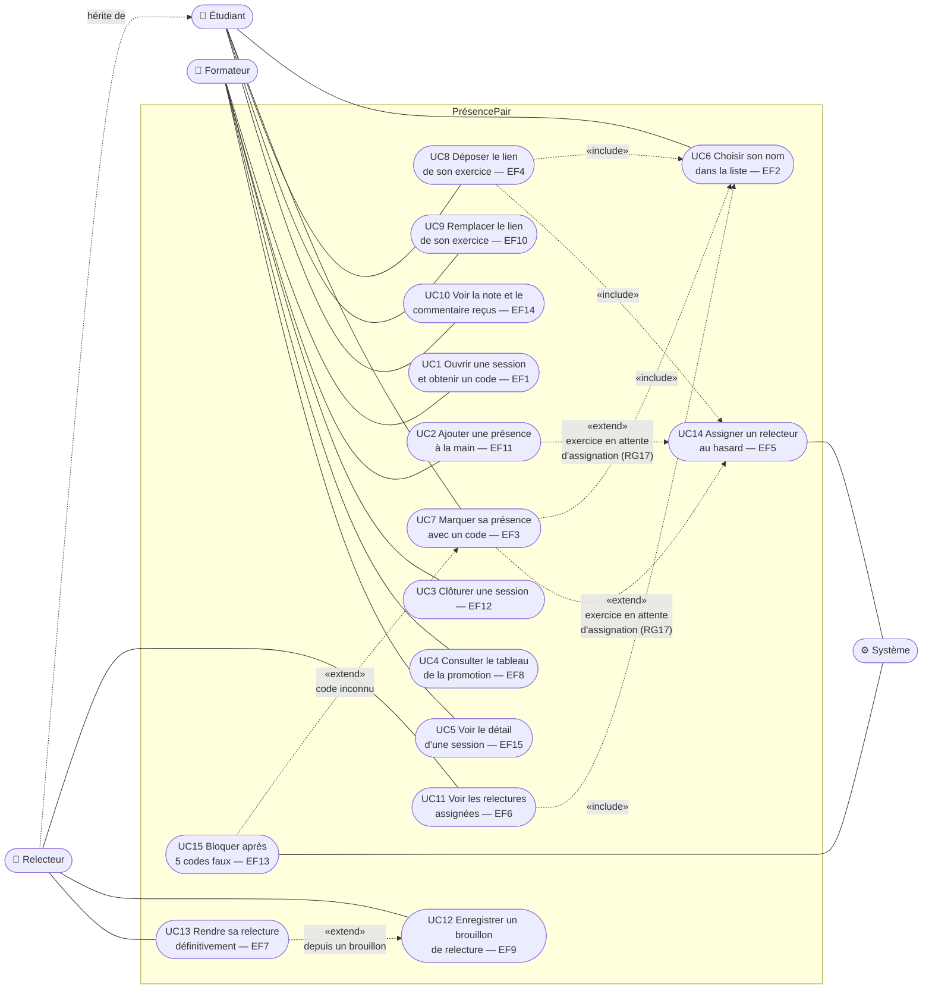

# D1 — Cas d'utilisation

Mermaid n'a pas de diagramme de cas d'utilisation natif : les acteurs sont représentés à gauche et à droite, les cas d'utilisation par des ovales à l'intérieur du cadre du système. Les liens `include` et `extend` suivent la notation UML.

Le **relecteur** est un étudiant dans un rôle particulier (cahier des charges, section 2) : il hérite de l'acteur Étudiant.

## Lecture

| Acteur | Cas d'utilisation | Priorité |
|---|---|---|
| Formateur | UC1, UC4 | Must |
| Formateur | UC2, UC3 | Should |
| Formateur | UC5 | Could |
| Étudiant | UC6, UC7, UC8 | Must |
| Étudiant | UC9, UC10 | Should |
| Relecteur | UC11, UC13 | Must |
| Relecteur | UC12 | Should |
| Système | UC14 (Must), UC15 (Should) | — |
