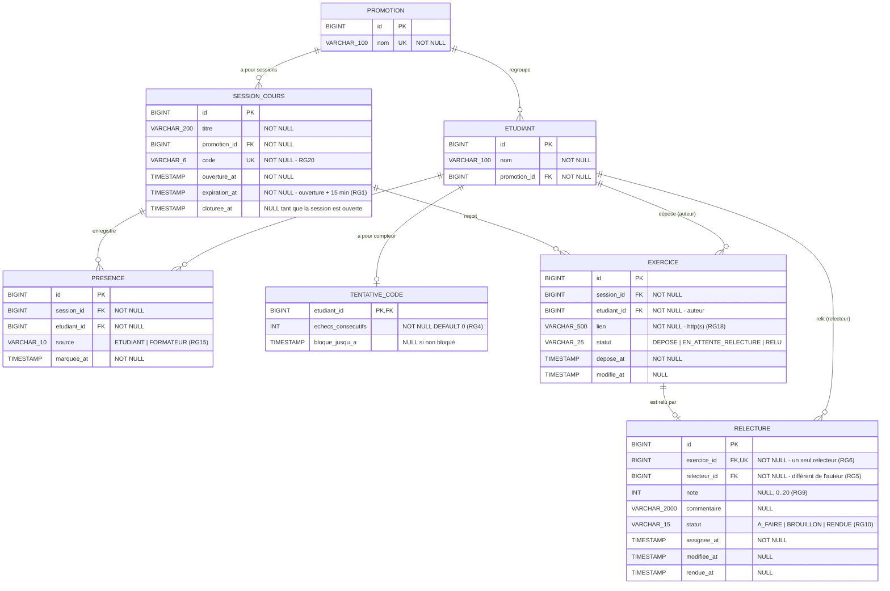

# D2 — Modèle de données

Ce diagramme décrit **exactement** le schéma créé par les migrations Flyway de `backend/src/main/resources/db/migration/` : mêmes tables, mêmes colonnes, mêmes contraintes. Toute migration qui modifie le schéma doit modifier ce fichier dans le même commit.

## Contraintes d'intégrité

| Contrainte | Table | Règle |
|---|---|---|
| `UNIQUE (session_id, etudiant_id)` | `presence` | RG3 — une présence par étudiant et par session |
| `UNIQUE (session_id, etudiant_id)` | `exercice` | RG13 — un exercice par étudiant et par session |
| `UNIQUE (exercice_id)` | `relecture` | RG6 — un seul relecteur par exercice |
| `UNIQUE (code)` | `session_cours` | RG20 — code unique |
| `CHECK (note BETWEEN 0 AND 20)` | `relecture` | RG9 |
| `CHECK (source IN ('ETUDIANT','FORMATEUR'))` | `presence` | RG15 |
| `CHECK (statut IN (...))` | `exercice`, `relecture` | cycle de vie, voir D4 |

La règle RG5 (relecteur ≠ auteur) porte sur deux tables : elle est garantie par le service d'assignation et vérifiée par un test unitaire, pas par une contrainte SQL.

## Cardinalités

- Une **promotion** regroupe 0..n étudiants et 0..n sessions ; un étudiant appartient à exactement 1 promotion.
- Une **session** a 0..n présences et 0..n exercices.
- Un **étudiant** a au plus 1 présence et au plus 1 exercice **par session**.
- Un **exercice** a 0..1 relecture : 0 tant qu'il est `DEPOSE` (aucun relecteur éligible, RG17), 1 ensuite.
- Un **étudiant** peut être relecteur de 0..n relectures.
- Un **étudiant** a 0..1 compteur de tentatives (créé à sa première erreur de code).
