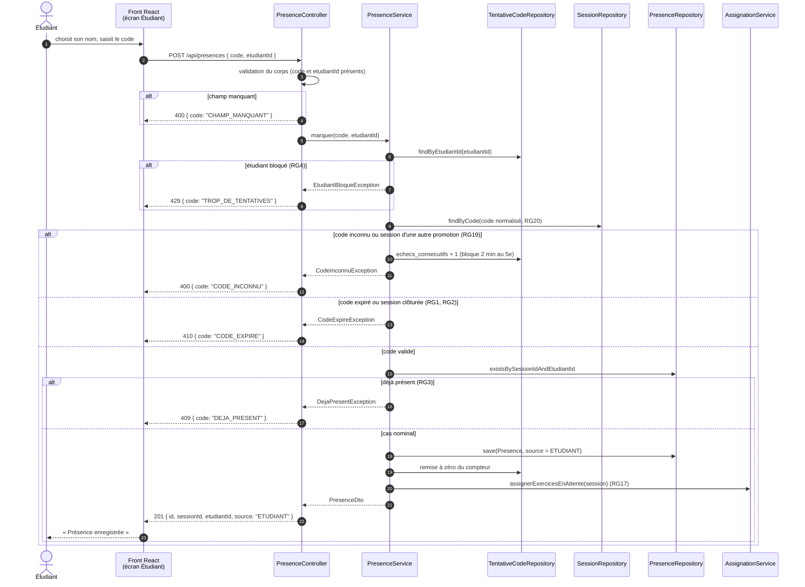

# D3 — Séquence : marquer sa présence

Opération imposée `POST /api/presences` (contrat, `api/contrat.yaml`). Chaque sortie du diagramme correspond à un code HTTP et à un code d'erreur du contrat.

Ordre des contrôles dans le service : blocage (RG4) → code connu → promotion (RG19) → expiration ou clôture (RG1, RG2) → doublon (RG3).

## Correspondance avec le contrat

| Cas | HTTP | `code` d'erreur | Règle |
|---|---|---|---|
| Présence enregistrée | 201 | — | EF3 |
| Champ manquant ou étudiant inconnu | 400 | `CHAMP_MANQUANT`, `ETUDIANT_INCONNU` | — |
| Code inconnu | 400 | `CODE_INCONNU` | RG19, RG4 |
| Déjà présent | 409 | `DEJA_PRESENT` | RG3 |
| Code expiré ou session clôturée | 410 | `CODE_EXPIRE` | RG1, RG2 |
| Trop de tentatives | 429 | `TROP_DE_TENTATIVES` | RG4 |

Le compteur d'échecs est enregistré dans une transaction séparée, pour qu'il ne soit pas annulé par l'exception `CodeInconnuException`.
