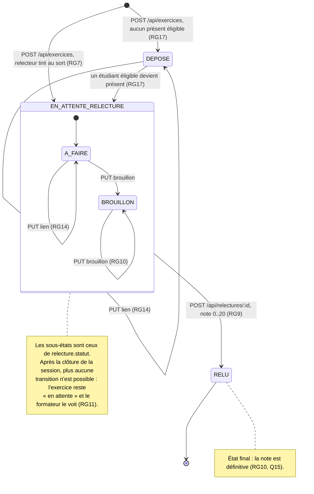

# D4 — États-transitions : cycle de vie d'un exercice

Colonne `exercice.statut` (voir D2). Le statut `DEPOSE` existe à cause du trou identifié en section 7 du cahier des charges : un exercice peut être déposé alors qu'aucun relecteur n'est éligible.

## Transitions refusées

| Depuis | Action | Réponse |
|---|---|---|
| `EN_ATTENTE_RELECTURE / BROUILLON` | remplacer le lien | `409 RELECTURE_COMMENCEE` (RG14) |
| `RELU` | remplacer le lien | `409 RELECTURE_COMMENCEE` |
| `RELU` | rendre ou modifier la relecture | `409 RELECTURE_DEJA_RENDUE` (RG10) |
| tout état, session clôturée | lien, brouillon, relecture | `409 SESSION_CLOTUREE` (RG12, RG11) |
