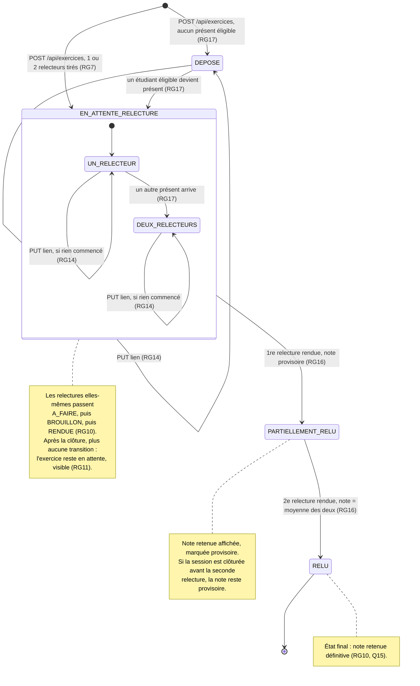

# D4 — États-transitions : cycle de vie d'un exercice

> **Version 2 (étape 3)** : conséquence du changement « deux relecteurs par exercice ». Nouvel état `PARTIELLEMENT_RELU` (une relecture rendue sur deux, note retenue **provisoire**), et `RELU` n'est atteint qu'avec deux relectures rendues. La version 1 (un seul relecteur) est dans l'historique Git.

Colonne `exercice.statut` (voir D2). Le statut `DEPOSE` existe à cause du trou identifié en section 7 du cahier des charges : un exercice peut être déposé alors qu'aucun relecteur n'est éligible.

## Transitions refusées

| Depuis | Action | Réponse |
|---|---|---|
| une relecture en `BROUILLON` ou `RENDUE` | remplacer le lien | `409 RELECTURE_COMMENCEE` (RG14) |
| `PARTIELLEMENT_RELU`, `RELU` | remplacer le lien | `409 RELECTURE_COMMENCEE` |
| relecture déjà `RENDUE` | la rendre à nouveau | `409 RELECTURE_DEJA_RENDUE` (RG10) |
| tout état, session clôturée | lien, brouillon, relecture | `409 SESSION_CLOTUREE` (RG12, RG11) |
